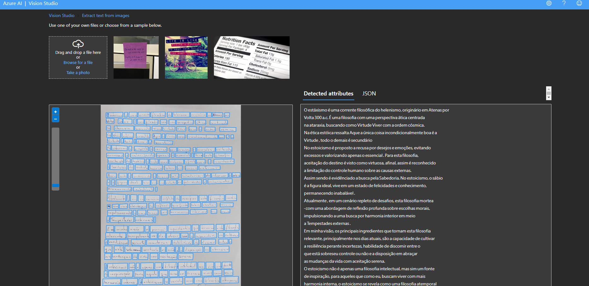

# Repositório GitHub - Bootcamp Microsoft Azure AI Fundamentals

## Descrição

Este repositório documenta minhas experiências e aprendizados no bootcamp da DIO sobre Microsoft Azure AI Fundamentals, com foco na preparação para a certificação AI-900. O conteúdo inclui:

### Projetos de laboratório

* Reconhecimento Facial

## Objetivos

* Demonstrar conhecimento fundamental sobre os serviços de IA do Microsoft Azure.
* Apresentar habilidades práticas na aplicação de conceitos de IA em cenários reais.
* Preparar para o exame de certificação AI-900.

# Evidências dos testes:

# JSON Model

[
  {
    "recognitionModel": "recognition_01",
    "faceRectangle": {
      "width": 1549,
      "height": 2184,
      "left": 1833,
      "top": 2096
    },
    "faceLandmarks": {
      "pupilLeft": {
        "x": 2264.9,
        "y": 2943
      },
      "pupilRight": {
        "x": 2995.1,
        "y": 2942.7
      },
      "noseTip": {
        "x": 2621.4,
        "y": 3193.6
      },
      "mouthLeft": {
        "x": 2319.5,
        "y": 3655.9
      },
      "mouthRight": {
        "x": 2917.7,
        "y": 3657.4
      },
      "eyebrowLeftOuter": {
        "x": 2065.8,
        "y": 2760.6
      },
      "eyebrowLeftInner": {
        "x": 2437.1,
        "y": 2723.6
      },
      "eyeLeftOuter": {
        "x": 2133.9,
        "y": 2958.2
      },
      "eyeLeftTop": {
        "x": 2278.6,
        "y": 2904.8
      },
      "eyeLeftBottom": {
        "x": 2250.5,
        "y": 2966.9
      },
      "eyeLeftInner": {
        "x": 2396.6,
        "y": 2942.2
      },
      "eyebrowRightInner": {
        "x": 2806.8,
        "y": 2735.3
      },
      "eyebrowRightOuter": {
        "x": 3222,
        "y": 2818.2
      },
      "eyeRightInner": {
        "x": 2868,
        "y": 2944.3
      },
      "eyeRightTop": {
        "x": 2983.8,
        "y": 2900.5
      },
      "eyeRightBottom": {
        "x": 3001.4,
        "y": 2967.5
      },
      "eyeRightOuter": {
        "x": 3127.3,
        "y": 2958.8
      },
      "noseRootLeft": {
        "x": 2515.2,
        "y": 2942.5
      },
      "noseRootRight": {
        "x": 2734.7,
        "y": 2929.7
      },
      "noseLeftAlarTop": {
        "x": 2456.9,
        "y": 3159.2
      },
      "noseRightAlarTop": {
        "x": 2792,
        "y": 3152.8
      },
      "noseLeftAlarOutTip": {
        "x": 2394.9,
        "y": 3305.4
      },
      "noseRightAlarOutTip": {
        "x": 2853.4,
        "y": 3314.9
      },
      "upperLipTop": {
        "x": 2639.3,
        "y": 3573.6
      },
      "upperLipBottom": {
        "x": 2621.1,
        "y": 3621.7
      },
      "underLipTop": {
        "x": 2617.7,
        "y": 3639.6
      },
      "underLipBottom": {
        "x": 2621.7,
        "y": 3705.3
      }
    },
    "faceAttributes": {
      "mask": {
        "type": "noMask",
        "noseAndMouthCovered": false
      }
    }
  }
]