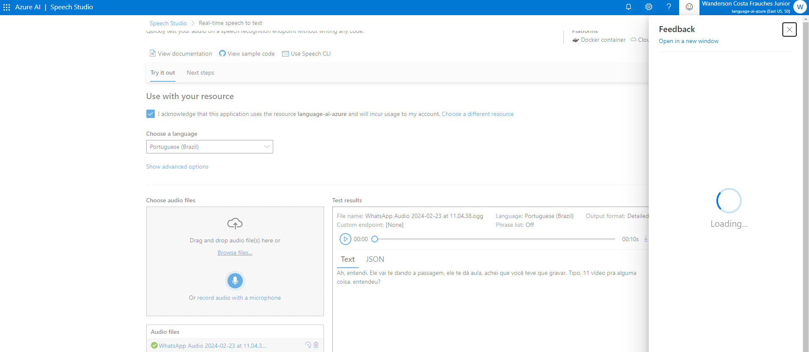
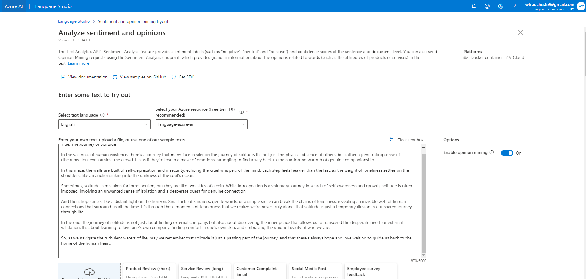
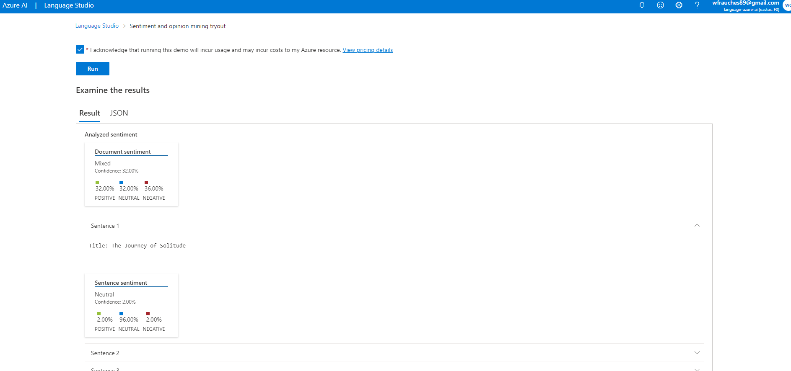
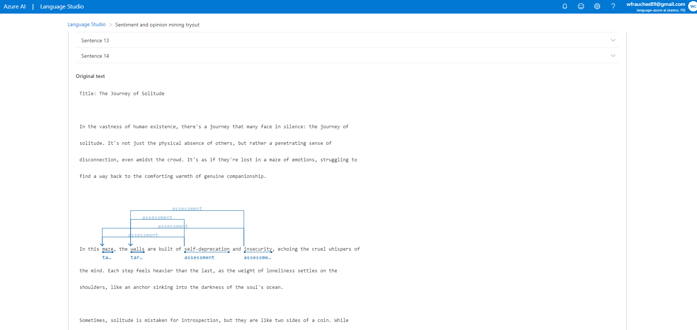

# Repositório GitHub - Bootcamp Microsoft Azure AI Fundamentals

## Análise de Sentimentos com Language Studio no Azure AI

### Projetos de laboratório

- Análise de Sentimentos com Language Studio no Azure AI

## Objetivos

- Crie um modelo de análise

Evidências dos testes:

