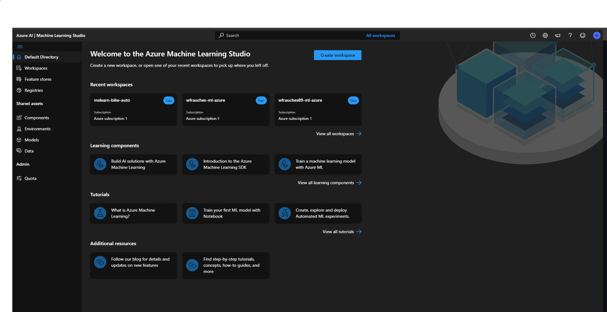
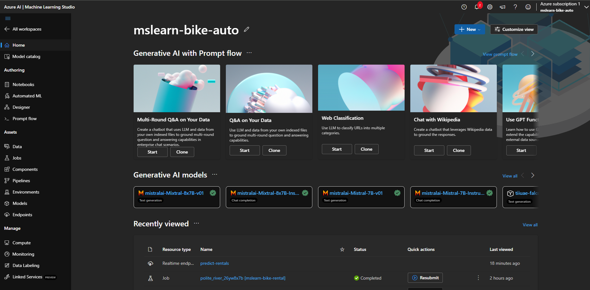
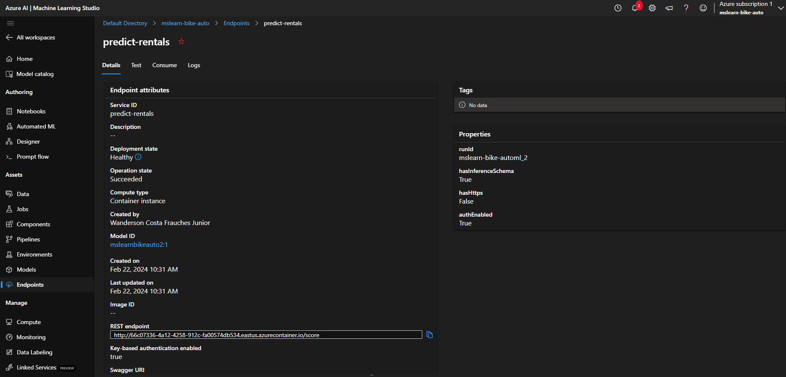
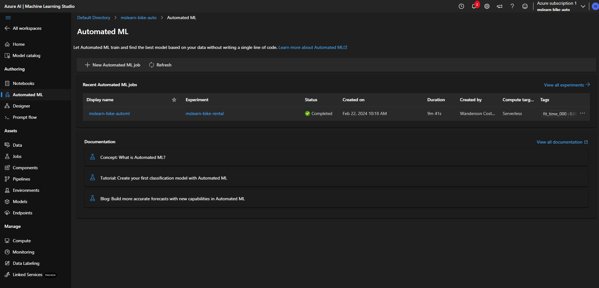
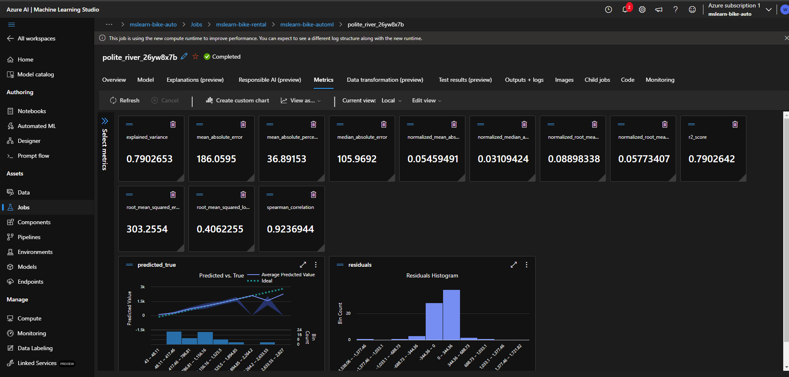

# Repositório GitHub - Bootcamp Microsoft Azure AI Fundamentals

## Machine learning - Azure Machine Learning Studio

### Projetos de laboratório

- Machine Learning

## Objetivos

- Crie um modelo de previsão com seus devidos pontos de extremidade configurados

Evidências dos testes:

